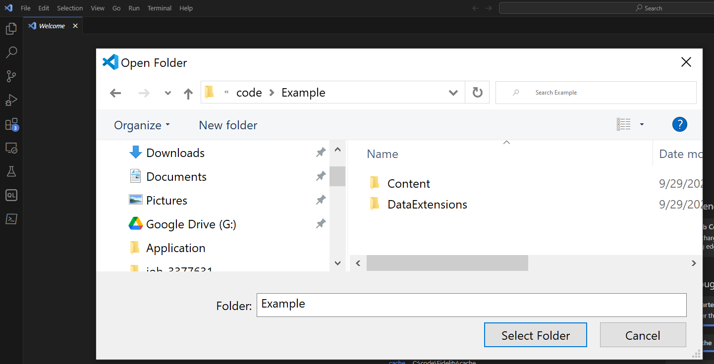

# AMPscript Core

AMPscript Core is an open source implementation of the Marketing Cloud AMPscript language.

It is cross platform and works on Windows, macOS and Linux.

A VSCode plugin is available to edit, run and debug AMPscript files locally on your machine.


## Getting Started Using the VSCode Plugin

The VSCode plugin provides syntax highlighting and debugging capability for AMPscript files.
The plugin supports files with a ".ampscript" extension.

It is not yet available on the VSCode marketplace. In order use it, you will need to download and install the VSIX file that contains the plugin.

#### Download and Install VSCode

If it isn't already installed on your computer, install Visual Studion Code (VS Code). You can download the latest version of VS Code from https://code.visualstudio.com/download.

#### Download and Install the .NET SDK

If it isn't already installed on your computer, install the .NET SDK version 8.0. You can download the SDK from https://dotnet.microsoft.com/en-us/download/dotnet.

#### Download the VSIX plugin

Download the latest VSIX release from the [releases](https://github.com/SalesforceLabs/ampscript-core/releases) tab.

Install the plugin using "Install From VSIX" in the extensions menu.


#### Unzip the example

Download the example ZIP from the [releases](https://github.com/SalesforceLabs/ampscript-core/releases) tab, and unzip this somewhere on your computer.

Do File->Open Folder and choose the folder where this was unzipped.



#### Start the example

Double click on the "dd4tmp.ampscript" file, then go to the "Run and Debug" section of the editor and click "Run and Debug".

 

A browser window should appear with the example running. From here - you can make any changes to the example and reload your browser window.


## Subscriber Attributes

Subscriber attributes `%%Foo%%`/`[Foo]` are supported through a JSON file named `subscriber.json` in the working directory.

Supported within the JSON file is a key/value pair of the attribute name and value.

Example:

```json
{
    "FirstName": "Logan"
}
```

The attribute values can be referenced via:

```ampscript
%%[
    SET @FIRSTNAME = [FirstName]
]%%

Hello %%=V(@FIRSTNAME)=%%
or
Hello %%FirstName%%
```

## Referencing Content

Content functions can reference content local on disk. The files must exist in a `Content` subdirectory of the working directory.

Example, if you have a file at `Content\EmbeddedContent.ampscript`, then you can reference it via:

```ampscript
%%=CONTENTBLOCKBYNAME("EmbeddedContent")=%%
```

## Data Extensions

Data Extension support is provided through CSV files on disk. The files must exist in a `DataExtensions` subdirectory of the working directory. The CSV file must contain headers which represent the columns.

Example, if you have a file at `DataExtensions\Loyalty.csv`, then it will use this CSV file as the data extension.

`DataExtensions\Loyalty.csv`

```csv
EmailAddress,SubscriberKey,FirstName,LastName,LoyaltyLevel
donnie@northerntrailoutfitters.com,1,Donnie,Stanton,Silver
```

`Index.ampscript`

```ampscript
Hello %%=LOOKUP("Loyalty", "FirstName", "emailAddress", "donnie@northerntrailoutfitters.com")=%%
```

Outputs:

```ampscript
Hello Donnie
```

### ⚠️ AMPscript Support

| Feature                                             | Summary              |
| --------------------------------------------------- | -------------------- |
| Ampscript Blocks `%%[]%%`                           | ✔️                   |
| Variables                                           | ✔️                   |
| For `for`                                           | ✔️                   |
| If `if`                                             | ✔️                   |
| Logic Operators `==`, `!=`, `&&`, etc               | ✔️                   |
| Inline Ampscript `%%= =%%`                          | ✔️                   |
| Personalization Strings `[Foo]` or `%%Foo%%`        | ✔️                   |
| Tag Syntax `<script language="ampscript">`          | ✔️                   |
| System Strings `xtmonth, jobid, subscriberkey, etc` | ⛔ Not Yet Supported |

## Marketing Cloud Supported Languages

| Language  | Summary            |
| --------- | ------------------ |
| AMPscript | ⚠️ Partial support |
| SSJS      | ⛔ Not supported   |
| GTL       | ⛔ Not Supported   |

## Supported Functions

If the function isn't listed here, then it's not supported.
| Function Area | Supported / Notes |
|----------|---------|
|[Marketing Cloud API](https://ampscript.guide/marketing-cloud-api-functions/)| ⛔ Not Supported |
|[Contact Model](https://ampscript.guide/content-model-functions/)| ⛔ Not Supported |
|[Content](https://ampscript.guide/content-functions/)| ⚠️ Partial support |
|[Data Extensions](https://ampscript.guide/data-extension-functions/)| ⚠️ Partial Support |
|[Date and Time](https://ampscript.guide/date-and-time-functions/)| ⚠️ Partial Support |
|[Einstein](https://ampscript.guide/einstein-email-recommendation-functions/)| ⛔ Not Supported |
|[Encryption](https://ampscript.guide/encryption-and-encoding-functions/)| ⛔ Not Supported |
|[HTTP](https://ampscript.guide/http-functions/)| ⛔ Not Supported |
|[Math](https://ampscript.guide/math-functions/)| ✔️ |
|[Microsoft Dynamics](https://ampscript.guide/microsoft-dynamics-crm-functions/)| ⛔ Not Supported |
|[Sales and Service Cloud](https://ampscript.guide/sales-and-service-cloud-functions/)| ⛔ Not Supported |
|[Site](https://ampscript.guide/site-based-functions/)| ⛔ Not Supported |
|[Social](https://ampscript.guide/social-functions/)| ⛔ Not Supported |
|[String](https://ampscript.guide/string-functions/)| ⚠️ Partial Support |
|[Utility](https://ampscript.guide/utility-functions/)| ⚠️ Partial Support |
|[Content Syndication](https://ampscript.guide/content-syndication/)| ⛔ Not Supported |

## Roadmap

-   Increase supported feature
-   SSJS & GTL
-   Static code analysis tools to identify and remediate performance or security issues

## Docs

-   [Code of Conduct](./CODE_OF_CONDUCT.md)
-   [LICENSE](./LICENSE)
