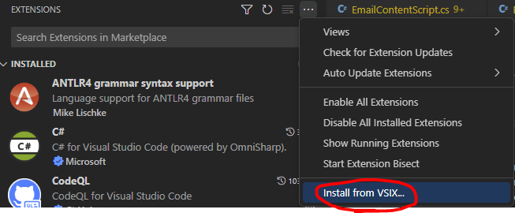
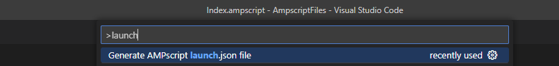
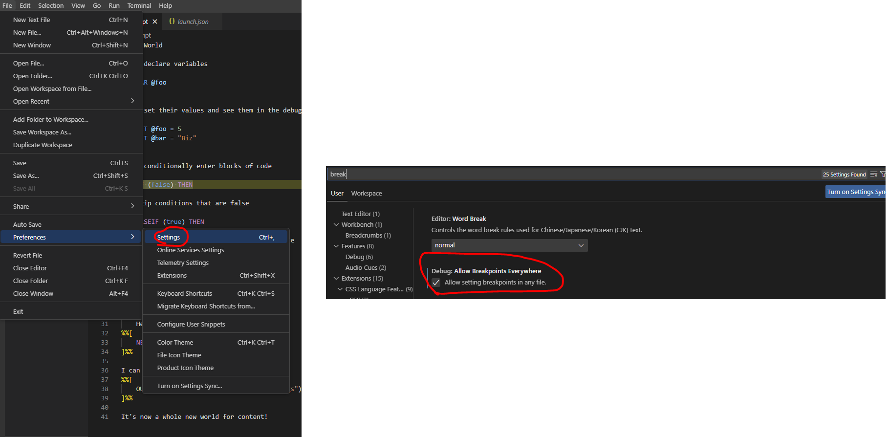
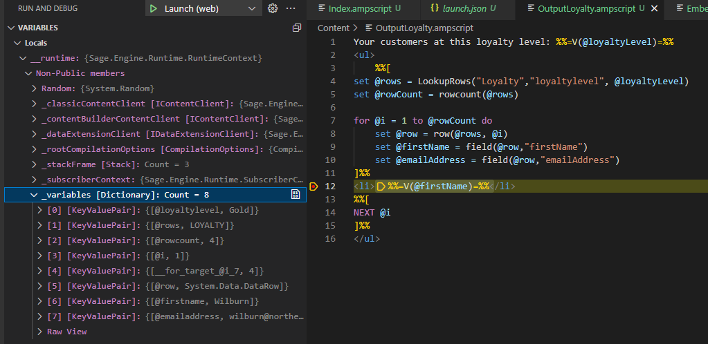

# Using the Preview Sage VSCode Plugin

The Sage VSCode plugin provides syntax highlighting and debugging capability for AMPscript files.

The plugin supports files with a ".ampscript" extension.

The Sage VSCode plugin is not yet available on the marketplace.  In order use it, you will need to:
* Download and install the VSIX file that contains the plugin
* Generate a "launch.json" file, which provides VSCode the information on how to debug AMPscript
* Modify VSCode settings to enable setting breakpoints in ampscript files

Once installed and set up, you can debug your ampscript content.

## Install
[Download the VSIX plugin](https://sfdc.co/sage-vscode)

Install the plugin using "Install From VSIX" in the extensions menu



## Generate a "launch.json" file
This is only required once for the project.  If a launch.json has already been generated, this step can be skipped.

To generate the launch.json file, hit CTRL+SHIFT+P to bring up the command pallet and choose "Generate AMPscript launch.json file"



## Enable breakpoints in ampscript files
To be able to set breakpoints in AMPscript files, you must enable the "Allow setting breakpoints in any file" setting in VSCode.



## Execute and debug content
Hit F5 to launch a web browser where you can see the results of the content.

## Example
To get started with a fully-working example that demonstrates content, data extension and subscriber context usage, see [The Loyalty Example](../example/loyalty/)

## Viewing Variables
You can view the value of any variables though expanding the `__runtime|Non-Public members|_variables` in the `Variables` window of the VSCode debugger.



## Data Extensions
Data Extension support is provided through CSV files on disk.  The files must exist in a `DataExtensions` subdirectory of the working directory. The CSV file must contain headers which represent the columns.

Example, if you have a file at `DataExtensions\Loyalty.csv`, then it will use this CSV file as the data extension.

`DataExtensions\Loyalty.csv`
```csv
EmailAddress,SubscriberKey,FirstName,LastName,LoyaltyLevel
donnie@northerntrailoutfitters.com,1,Donnie,Stanton,Silver
```

`Index.ampscript`
```ampscript
Hello %%=LOOKUP("Loyalty", "FirstName", "emailAddress", "donnie@northerntrailoutfitters.com")=%%
```

Outputs:
```ampscript
Hello Donnie
```

## Subscriber Attributes
Subscriber attributes `%%Foo%%`/`[Foo]` are supported through a JSON file named `subscriber.json` in the working directory.

Supported within the JSON file is a key/value pair of the attribute name and value.

Example:
```json
{
    "FirstName": "Logan"
}
```

The attribute values can be referenced via:
```ampscript
%%[
    SET @FIRSTNAME = [FirstName]
]%%

Hello %%=V(@FIRSTNAME)=%%
or
Hello %%FirstName%%
```

## Referencing Content
Content functions can reference content local on disk.  The files must exist in a `Content` subdirectory of the working directory.

Example, if you have a file at `Content\EmbeddedContent.ampscript`, then you can reference it via:
```ampscript
%%=CONTENTBLOCKBYNAME("EmbeddedContent")=%%
```